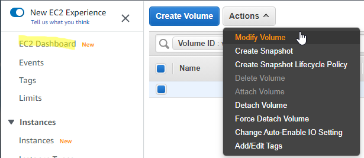

# Extend a Linux file system

###  Resizing a volume


### Extend the file system of NVMe EBS volumes
```
$ df -hT
Filesystem     Type      Size  Used Avail Use% Mounted on
devtmpfs       devtmpfs  960M     0  960M   0% /dev
tmpfs          tmpfs     978M     0  978M   0% /dev/shm
tmpfs          tmpfs     978M  496K  978M   1% /run
tmpfs          tmpfs     978M     0  978M   0% /sys/fs/cgroup
/dev/nvme0n1p1 xfs        10G  7.8G  2.3G  78% /
tmpfs          tmpfs     196M     0  196M   0% /run/user/1000
tmpfs          tmpfs     196M     0  196M   0% /run/user/0

$ lsblk
NAME          MAJ:MIN RM SIZE RO TYPE MOUNTPOINT
nvme0n1       259:0    0  20G  0 disk 
├─nvme0n1p1   259:1    0  10G  0 part /
└─nvme0n1p128 259:2    0   1M  0 part 

$ sudo growpart /dev/nvme0n1 1
CHANGED: partition=1 start=4096 old: size=20967391 end=20971487 new: size=41938911 end=41943007

$ df -hT
Filesystem     Type      Size  Used Avail Use% Mounted on
devtmpfs       devtmpfs  960M     0  960M   0% /dev
tmpfs          tmpfs     978M     0  978M   0% /dev/shm
tmpfs          tmpfs     978M  496K  978M   1% /run
tmpfs          tmpfs     978M     0  978M   0% /sys/fs/cgroup
/dev/nvme0n1p1 xfs        10G  7.8G  2.3G  78% /
tmpfs          tmpfs     196M     0  196M   0% /run/user/1000
tmpfs          tmpfs     196M     0  196M   0% /run/user/0

$ lsblk
NAME          MAJ:MIN RM SIZE RO TYPE MOUNTPOINT
nvme0n1       259:0    0  20G  0 disk 
├─nvme0n1p1   259:1    0  20G  0 part /
└─nvme0n1p128 259:2    0   1M  0 part 

$ sudo xfs_growfs -d /
meta-data=/dev/nvme0n1p1         isize=512    agcount=6, agsize=524159 blks
         =                       sectsz=512   attr=2, projid32bit=1
         =                       crc=1        finobt=1 spinodes=0
data     =                       bsize=4096   blocks=2620923, imaxpct=25
         =                       sunit=0      swidth=0 blks
naming   =version 2              bsize=4096   ascii-ci=0 ftype=1
log      =internal               bsize=4096   blocks=2560, version=2
         =                       sectsz=512   sunit=0 blks, lazy-count=1
realtime =none                   extsz=4096   blocks=0, rtextents=0
data blocks changed from 2620923 to 5242363

$ df -hT
Filesystem     Type      Size  Used Avail Use% Mounted on
devtmpfs       devtmpfs  960M     0  960M   0% /dev
tmpfs          tmpfs     978M     0  978M   0% /dev/shm
tmpfs          tmpfs     978M  496K  978M   1% /run
tmpfs          tmpfs     978M     0  978M   0% /sys/fs/cgroup
/dev/nvme0n1p1 xfs        20G  7.8G   13G  39% /
tmpfs          tmpfs     196M     0  196M   0% /run/user/1000
tmpfs          tmpfs     196M     0  196M   0% /run/user/0
```

### NodeJS update
```
$ sudo yum -y update

$ sudo yum install -y gcc-c++ make
$ curl -sL https://rpm.nodesource.com/setup_14.x | sudo -E bash -
$ sudo yum install -y nodejs
$ nvm install 14.16
$ nvm ls
$ node --version

$ sudo npm install yarn -g
```

### Typescript
```
$ yarn global add typescript
$ tsc --version
```