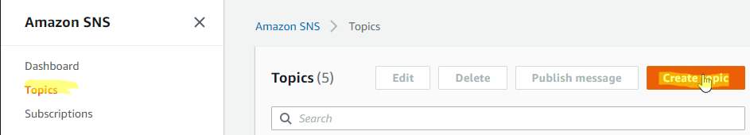
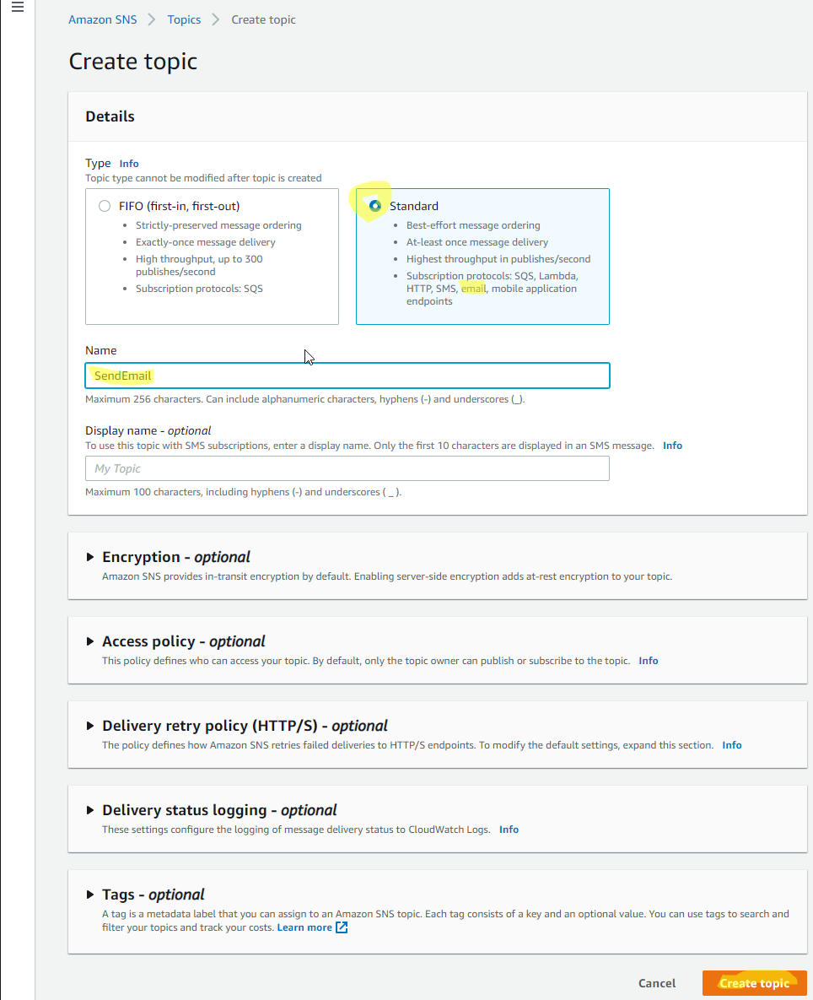
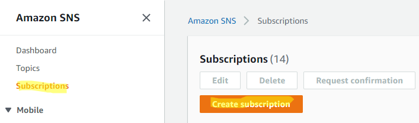
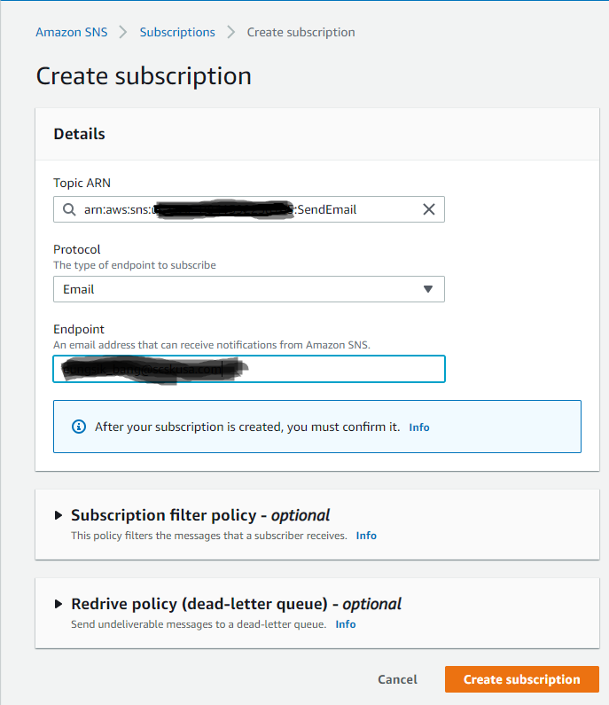
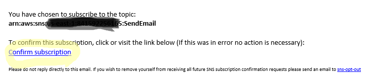
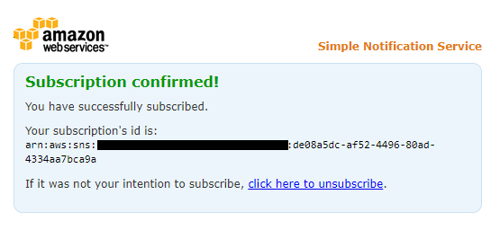
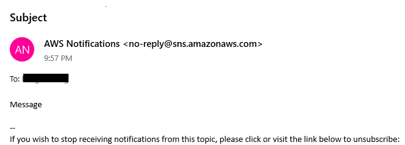

# Sending emails using SNS
### Create Topic



### Create Subscription



### Confirm Subscription



### Lambda Function
```python
import boto3

def lambda_handler(event, context):
    client = boto3.client('sns')

    TOPIC_ARN = 'arn:aws:sns:XXXXXXXXXXXXXX:SendEmail'     
    msg = 'Message'
    subject = 'Subject'

    response = client.publish(
        TopicArn = TOPIC_ARN,
        Message = msg,
        Subject = subject
    )

    return response
```


